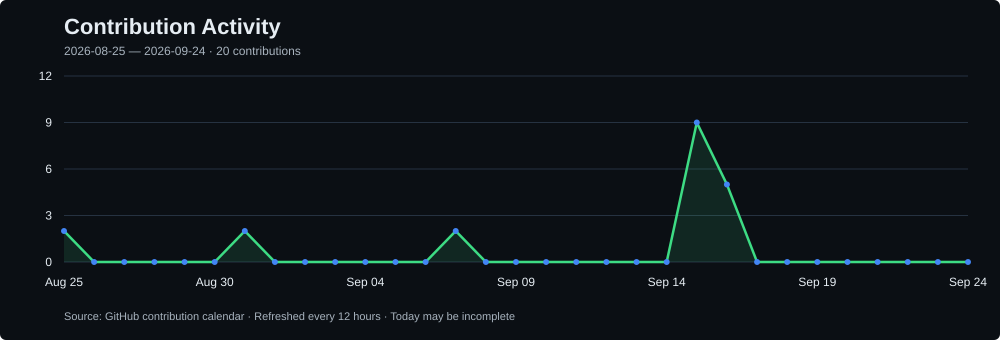

<div align="center">
  
</div>

<br/>

<div align="center">

| `SYSTEM` | `VALUE` | `SYSTEM` | `VALUE` |
|:---|:---|:---|:---|
| **Status** | 🟢 Building Android apps | **Primary Stack** | Kotlin + Jetpack Compose |
| **Cross-Platform** | KMP · Flutter / Dart | **Backend & Web** | TypeScript · Go · Python |
| **Focus** | Clean Architecture · Performance · UX | **Timezone** | UTC+5 |

</div>

<div align="center">
  <i>I build Android apps like complete systems: clean UI, reliable data flow, maintainable architecture, and smooth product experience.</i>
</div>

<br/>

<div align="center">
  <a href="https://www.linkedin.com/in/jamshidbek-boynazarov-956227248">
    
  </a>
  &nbsp;
  <a href="https://github.com/Jamie10X">
    
  </a>
  &nbsp;
  <a href="mailto:jamshidboynzarov0@gmail.com">
    
  </a>
  &nbsp;
  
</div>

---

## `>_ jamie10x@github`

```bash
jamie10x@github:~$ whoami
Jamshidbek Boynazarov — Software Engineer | Android Developer
Android-focused engineer building mobile applications and complete software products.
Primary stack: Kotlin, Java, Jetpack Compose, and modern Android architecture.

location           → Namangan, Uzbekistan
portfolio          → https://jamshiddev.uz
current            → Software Engineer, Tarmoqda LLC · 2025–Present
                     KMP mobile development, API integration, and cross-team collaboration
previous           → Freelance Software Engineer · 2021–2025
                     Android, backend APIs, Telegram automation, and full-stack products
education          → B.Sc. Computer Engineering, Dongseo University · 2021–2025
                     Busan, South Korea
languages          → Uzbek · Native | English · Advanced | Russian · Beginner

jamie10x@github:~$ build-modes
native-android     →  Kotlin, Java, Jetpack Compose, Room, REST APIs, MVVM/MVI
kotlin-multiplatform → shared mobile business logic and reusable components
flutter            →  cross-platform mobile apps with Dart & Firebase
web-backend        →  REST APIs, Node.js, TypeScript, Go, Python
problem-solving    →  algorithms, architecture design, product thinking
```

<br/>

## Featured Builds

| Project | What I Built | Stack |
|:---|:---|:---|
| **Tarmoqda** · Live & Published<br/>[Website](https://tarmoqda.uz/) · [Google Play](https://play.google.com/store/apps/details?id=uz.tarmoqda.app&pcampaignid=web_share) | Software Engineer at Tarmoqda LLC: develop the KMP mobile app for an employment and recruitment platform, integrate APIs, and collaborate across mobile, frontend, and backend | Kotlin · Kotlin Multiplatform · Compose Multiplatform · Ktor · Koin · Room · REST APIs |
| **Pic2PDF** · Published<br/>[Google Play](https://play.google.com/store/apps/details?id=com.neopulsar.pic2pdf) | Designed, developed, and released an offline image-to-PDF Android app with local file management and PDF generation | Android · PDF |
| **MyDoners** · Live · 2026<br/>[Telegram](https://t.me/mydoner_bot) | Full-stack & Android engineering across restaurant customer/admin interfaces, an Android Kitchen Display System, courier bot, real-time ordering backend, and deployment | Kotlin · Jetpack Compose · React · Telegram SDK · Bun · Express · TypeScript · PostgreSQL · Redis · Socket.io · Docker · Nginx |

<br/>

## Tech Stack

#### Native Android


#### Cross-Platform


#### Web & Backend


#### Tools


<br/>

## Architecture Fingerprint

<div align="center">
<br/>
<code>UI</code><br/>
<sub>Compose / Flutter</sub><br/>
↓<br/>
<code>ViewModel</code><br/>
<sub>State + Events</sub><br/>
↓<br/>
<code>Use Cases</code><br/>
<sub>Business Logic</sub><br/>
↓<br/>
<code>Repository</code><br/>
<sub>Single Source of Truth</sub><br/>
↓<br/>
<code>Remote API</code>&nbsp;&nbsp;·&nbsp;&nbsp;<code>Local Database</code>
<br/><br/>
</div>

<br/>

## Currently Syncing

*Auto-updating with the latest from the Android Developers Blog.*

<!--START_SECTION:learn-->
#### 📖 [Android Bench 2.0: Pushing the frontier with challenging long-horizon tasks](https://android-developers.googleblog.com/2026/09/android-bench-2-long-horizon-tasks.html)
<!--END_SECTION:learn-->

<br/>

## Stats & Activity
<div align="center">
  
</div>

<br/>

<div align="center">
  
  &nbsp;&nbsp;
  
</div>

<br/>

<div align="center">
  
  &nbsp;&nbsp;
  
</div>

<br/>

<div align="center">
  
</div>

---

## Coding Profiles

<div align="center">
  <a href="https://leetcode.com/u/jamie10x/">
    
  </a>
  &nbsp;
  <a href="https://www.hackerrank.com/jamshidboynazar1">
    
  </a>
  &nbsp;
  <a href="https://developers.google.com/profile/u/JamshidbekBoynazarov">
    
  </a>
</div>

<br/>

<div align="center">
  <sub>Open to full-time, remote, freelance, and international opportunities. Open to relocation for the right position.</sub><br/>
  <sub><a href="https://jamshiddev.uz">Portfolio</a> · <a href="mailto:jamshidboynzarov0@gmail.com">Email</a> · <a href="https://t.me/mr_jamshidbeek">Telegram</a> · Résumé: <a href="./assets/resumes/jamshidbek-boynazarov-resume-en.pdf">English</a> · <a href="./assets/resumes/jamshidbek-boynazarov-resume-uz.pdf">O‘zbekcha</a> · <a href="./assets/resumes/jamshidbek-boynazarov-resume-ru.pdf">Русский</a></sub>
</div>
