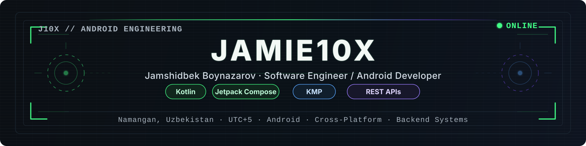
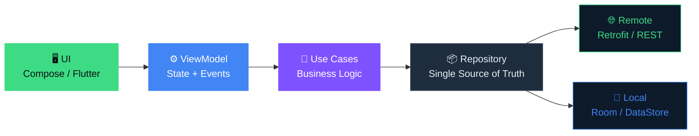

<div align="center">
  
</div>

<br/>

<div align="center">

| `SYSTEM` | `VALUE` | `SYSTEM` | `VALUE` |
|:---|:---|:---|:---|
| **Status** | 🟢 Building Android apps | **Primary Stack** | Kotlin + Jetpack Compose |
| **Cross-Platform** | Flutter / Dart | **Backend & Web** | TypeScript · Go · Python |
| **Focus** | Clean Architecture · Performance · UX | **Timezone** | UTC+5 |

</div>

<br/>

<div align="center">
  <a href="https://linkedin.com/in/jamshidbek-boynazarov-956227248">
    
  </a>
  &nbsp;
  <a href="https://github.com/Jamie10X">
    
  </a>
  &nbsp;
  <a href="mailto:jamshidboynazarov0@gmail.com">
    
  </a>
  &nbsp;
  
</div>

---

## `>_ jamie10x@github`

```bash
jamie10x@github:~$ whoami
Android Developer focused on Kotlin, Java, Jetpack Compose and clean architecture.
Builds production-ready mobile apps with great UX, tight performance, and scalable code.

jamie10x@github:~$ build-modes
native-android     →  production-ready mobile apps with Jetpack Compose & MVVM/MVI
flutter            →  cross-platform mobile apps with Dart & Firebase
web-backend        →  REST APIs, Node.js, TypeScript, Go, Python
problem-solving    →  algorithms, architecture design, product thinking
```

---

## Featured Builds

| Project | What I Built | Stack |
|:---|:---|:---|
| `native-android-app` | <!-- Replace: full-featured Android app with offline support --> | Kotlin · Compose · Room · Hilt |
| `flutter-cross-platform` | <!-- Replace: cross-platform mobile app for iOS & Android --> | Flutter · Dart · Firebase |
| `backend-api-project` | <!-- Replace: REST API with auth and database integration --> | Go · TypeScript · Node.js · MongoDB |

---

## Tech Stack

#### Native Android


#### Cross-Platform


#### Web & Backend


#### Tools


---

## Architecture Fingerprint



---

## Currently Syncing

*Auto-updating with the latest from the Android Developers Blog.*

<!--START_SECTION:learn-->
#### 📖 [How FotMob leveraged cross-device discovery to score record Wear OS adoption](https://android-developers.googleblog.com/2026/05/fotmob-wear-os-adoption-cross-device-discovery.html)
<!--END_SECTION:learn-->

---

## Stats & Activity

<div align="center">

  <a href="https://github.com/anuraghazra/github-readme-stats">
    
  </a>

  <a href="https://github.com/anuraghazra/github-readme-stats">
    
  </a>

  <a href="https://github.com/vn7n24fzkq/github-profile-summary-cards">
    
  </a>

  <a href="https://github.com/ashutosh00710/github-readme-activity-graph">
    
  </a>

</div>

---

## Coding Profiles

<div align="center">
  <a href="https://www.leetcode.com/Jamie1023">
    
  </a>
  &nbsp;
  <a href="https://www.hackerrank.com/jamshidboynazar1">
    
  </a>
  &nbsp;
  <a href="https://developers.google.com/profile/u/JamshidbekBoynazarov">
    
  </a>
</div>

---

<div align="center">
  <sub>Open to Android, Flutter, and backend collaboration.</sub>
</div>
